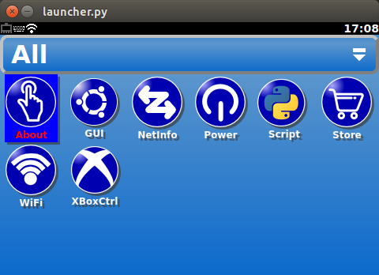

<!-- Include the following line in any markdown file to use LaTeX code. -->
 

## Home Screen

### Navigation
Navigating the home screen is done using either the xbox 360 controller (must be connected on start-up) or with a keyboard. The selector is moved using the D-pad on the xbox controller (see below) and to select something, the start button must be pressed. Pressing the start button is equivalent to pressing the enter key on a keyboard. When an application is started, the xbox controls are just forwarding keyboard signals. So sometimes to select something you need to press the spacebar on a keyboard which is equivalent to pressing both select+start on the xbox controller.

### Important Applications
